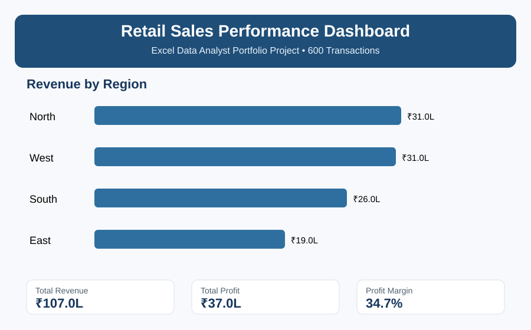

# Retail Sales Excel Dashboard



## Project Overview

This portfolio project analyzes **600 retail sales transactions** and turns raw transaction data into a management-ready Excel analysis workflow.

The project is designed to answer practical business questions such as:

- Which regions generate the most revenue?
- Which product categories contribute the most sales?
- How does revenue change month by month?
- What is the overall profit margin?
- Which areas should management investigate further?

## Tools & Skills Demonstrated

- Microsoft Excel
- Data cleaning and structuring
- Excel Tables
- SUMIF / COUNTIF
- IFERROR
- Date-based analysis
- Revenue, Cost and Profit calculations
- KPI analysis
- Dashboard design
- Business insight communication

## Dataset Snapshot

| KPI | Result |
|---|---:|
| Transactions | 600 |
| Total Revenue | ₹1,06,70,943 |
| Total Profit | ₹37,00,014 |
| Profit Margin | 34.7% |
| Highest-Revenue Region | North |
| Highest-Revenue Category | Furniture |
| Highest-Revenue Month | November 2025 |

> The dataset is synthetic and was created specifically for portfolio, learning and interview demonstration.

## Repository Structure

```text
retail-sales-excel-dashboard/
├── README.md
├── ANALYSIS_NOTES.md
├── DATA_DICTIONARY.md
├── dashboard_preview.svg
└── data/
    └── retail_sales_raw.csv
```

## Analysis Workflow

1. Start with transaction-level sales data.
2. Validate dates, product categories, regions, prices, discounts and costs.
3. Calculate:
   - Revenue
   - Cost
   - Profit
   - Profit Margin
4. Summarize results by region, category and month.
5. Build KPI cards and charts for management reporting.
6. Convert findings into business insights.

## Excel Formulas Practiced

```excel
Revenue = Units * Unit Price * (1 - Discount %)
Cost = Units * Unit Cost
Profit = Revenue - Cost
```

Example Excel formulas:

```excel
=H2*I2*(1-J2)
=H2*K2
=M2-N2
=SUMIF($C:$C,A2,$M:$M)
=COUNTIF($C:$C,A2)
=IFERROR(Profit/Revenue,0)
```

## Key Findings

- **North** generated the highest regional revenue in this portfolio dataset.
- **Furniture** was the highest-revenue product category.
- **November 2025** was the highest-revenue month.
- Overall profit margin was approximately **34.7%**.

## Resume-Ready Project Entry

**Retail Sales Performance Dashboard | Excel**

- Analyzed 600 retail transaction records using Excel.
- Built KPIs for revenue, profit and profit margin.
- Used formulas and summary analysis to compare regional, product-category and monthly performance.
- Created a management-ready dashboard structure to communicate business insights.

## Supporting Files

- [Raw Dataset](data/retail_sales_raw.csv)
- [Data Dictionary](DATA_DICTIONARY.md)
- [Analysis Notes](ANALYSIS_NOTES.md)

## Note

The completed Excel workbook is maintained as the working analysis file for this project. The GitHub repository contains the reproducible raw dataset, business logic, dashboard preview and project documentation.
